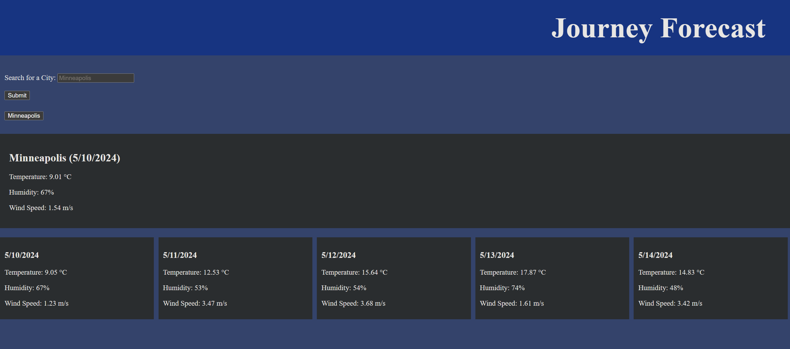

# journey-forecast

## Description & Purpose
A weather dashboard that travelers can use to plan ahead for the weather. I made this application as practice for my ability to utilize API data and doing so with an authorized key. I also took this project as an opportunity to 

## Installation
Simply access the application using the deployed URL:
https://kushonim.github.io/journey-forecast/ 

## Screenshot

## Usage
Input a valid city name in the city search bar and hit [enter] or click [submit]. It will provide the weather of that city for the current day and 5-day forecast.

## Author(s) & Contributions
@Kushonim - GitHub
https://github.com/Kushonim

## License
MIT License